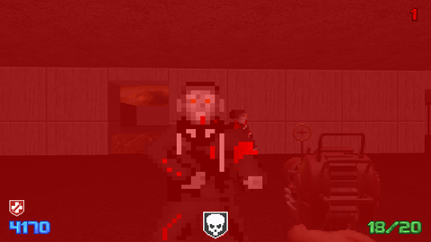

# Nacht des Schreckens

Consider this a custom zombies map for 'Call of Duty: World at War' but in the vein of a Doom 2 mod using the GZDoom source port. Like other Doom 2 mods, this requires a valid 'Doom2.wad' file via a legal copy of Doom 2. This map pulls or modifies many assets from 'World at War'. After the final release of the demo, further updates will have to be retrieved elsewhere and a valid copy of 'Call of Duty: World at War' will also be required to use this mod.

This mod is meant to bring the features and spirit of classic 'Call of Duty Zombies' maps into Doom 2 through a reimagining of their very first map. While this has been done before, I hope to bring this type of mod into a category of its own.

## Credit

### Base Games

- **id Software's Doom 2**: https://store.steampowered.com/app/10090/Call_of_Duty_World_at_War/

- **Treyarch's Call of Duty: World at War**: https://store.steampowered.com/app/10090/Call_of_Duty_World_at_War/
  
### Other Mods/Libraries Used

- **ZDL's COD Zombies**: https://www.moddb.com/mods/call-of-duty-nazi-zombies

- **dodopod's ZScript Weapons Library** (removed):  https://forum.zdoom.org/viewtopic.php?t=61172

- **Boondorl's Weather Library** https://github.com/Boondorl/Weather

- **[unknown]'s NTM Quick Kick** (could not find the exact link to the mod, so here's the inspirations/adaptations):

    - https://github.com/LocalInsomniac/NTMAi/blob/master/zscript/weapons/kick.txt

    - https://forum.zdoom.org/viewtopic.php?p=1181624#p1181624

### Crew

- **Tyler Wojciechowski**: Lead Developer

- **Alexis Dutcher**: Lead Artist

## Configuration

To run using the 'launch.bat' file, make sure the folder containing 'gzdoom.exe' is named 'gzdoom' and is next to the folder containing this project.

To avoid weapon sprite cropping, make sure the aspect ratio is set to 4:3 in-game (weapon sprites will be widened later to support wider ratios).

## Next Milestone

This mod is still early in development, so the map is very basic, the weapon roster is limited, and there are many placeholder textures. Currently, I am working towards a demo filling in these issues by creating a memorable starting area, porting more weapons from World at War, creating and pulling more assets, stabilizing the multiplayer experience, and adding an easter egg or two :)